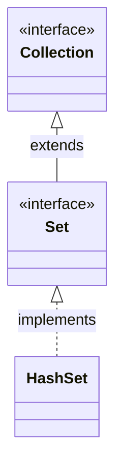
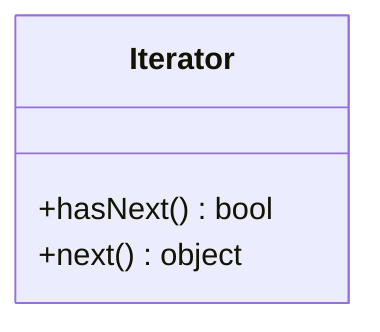
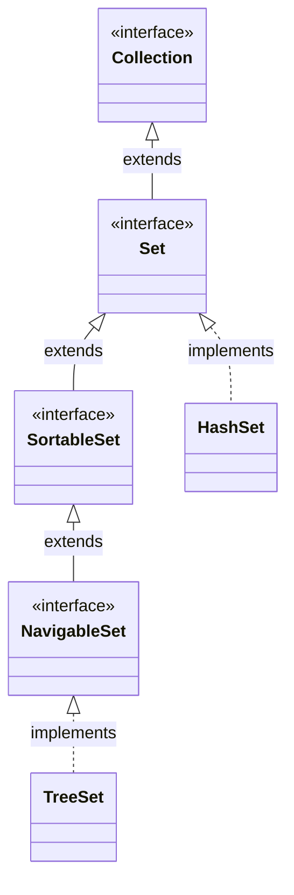

# Set集合

## Java集合概述

Java 集合类存放于 **java.util** 包中，是一个用来存放对象的容器。

1. 集合只能存放对象（当我们向集合中存入 **int 1** 时，实际上是自动转换成 **Integer** 类后存入的）。

2. 在 **jvm** 中，集合存放的是多个对象的引入，对象本身存在于堆内存中。

3. 集合可以存放不同类型，不限数量的数据类型。

Java 集合可分为 **Set **、**List** 、**Map** 三种

* Set：无序、不可重复的集合

* List：有序、可重复的集合

* Map：具有映射关系的集合

在 JDK5 之后，增加了 **泛型** ，Java集合可以记住容器中对象的数据类型。

## HashSet集合

HashSet 是 **Set** 接口的典型实现，大多数时候使用 **Set** 集合时都使用这个实现类。

我们大多数时候说的set集合指的都是 **HashSet** 。HashSet 是按照 **Hash 算法** 来存储集合中的元素，因此具有很好的存取和查找性能。

### HashSet 的特点

* 无序集合

* 不可重复

* **不是** 线程安全的

* 集合元素可以使用 **null**

当向 **HashSet** 集合中存入一个元素时，HashSet 会调用对象的 **hashCode()** 方法来得到该对象的 **hashCode** 值，然后根据 **hashCode** 值来决定该对象在 **hashSet** 中的存储位置。

```java
public class TestHashCode {
	public static void main(String[] args) {
		String s = new String("testofhashcode");
		System.out.println(s.hashCode());
        /*
          输出：
          1721218276
        */
	}
}
```

如果两个元素的 **equals**() 方法返回true，但它们的 **hashCode** 返回值不相等，hashSet 将会把它们存储在不同的位置，但依然可以添加成功。

### HashSet 的继承关系



### 使用 HashSet

从 java.util 下导入 HashSet 包就可以使用 HashSet 了

```java
// Set 和 HashSet 类在 java.util 中
import java.util.HashSet;

public class TestHashSet {
	public static void main(String[] args) {
		
		HashSet set = new HashSet();
		
		//添加一个元素
		set.add(1);
		
		//移除一个元素
		set.remove(1);
		
		//检查一个元素
		set.contains("a");//会返回 true/false
		
		//清空所有元素
		set.clear();
        
        //获取集合中元素的数量
        set.size();
		
	}
}
```

### HashSet 的迭代

#### 1. 迭代器

HashSet 的 iterator() 方法：返回一个 **Iterator ( 迭代器 )** 实例，用于迭代 **HashSet** 。**Iterator** 类也在 **java.util** 包下

hasNext() 方法：判断指针下一位置是否存在元素，返回 bool

next() 方法：指针后移一位并获取元素，返回 object



```java
// Iterator 和 HashSet 类在 java.util 中
import java.util.HashSet;
import java.util.Iterator;

public class TestHashSet {
	public static void main(String[] args) {
		
		HashSet set = new HashSet();
		
		set.add(1);
		set.add(2);
		set.add(3);
		
		//使用 iterator() 会返回一个 Iterator 实例
		Iterator it = set.iterator();
		
		//Iterator 的 hasNext() 函数 用于检查数组指针的下一个值
		while(it.hasNext()) {
			//Iterator 的 nexn() 函数 用于指针后移并返回指向的值
			System.out.println(it.next());
		}
		
	}
}
```

#### 2. for each

for ( Object obj :  <u>hashSet</u>) 语法可以用于遍历 HashSet

```java
// Iterator 和 HashSet 类在 java.util 中
import java.util.HashSet;
import java.util.Iterator;

public class TestHashSet {
	public static void main(String[] args) {
		
		HashSet set = new HashSet();
		
		set.add(1);
		set.add(2);
		set.add(3);
		
		// 将 set 中的每一个元素赋给 obj
		for ( Object obj : set) {
			System.out.println(obj);
		}
	}
}
```

### 泛型 ( Generics )

对于 **集合** 及其子类 ( 比如 **HashSet** ) ，可以使用 **<Class>** 泛型来限制其子类的类型。

```java
import java.util.HashSet;
import java.util.Set;

public class TestGenerics {
	public static void main(String[] args) {
		Set<String> set = new HashSet<String>();
		
		set.add("name"); // 正常工作
		
		set.add(1);
		/*
		  编译报错：
		  add()方法被泛型<String>限制了数据类型
		  The method add(String) in the type Set<String> is not applicable for the arguments (int)
		*/
	}
}
```

对于集合( Set、**List**、**Map** )来说，指定泛型为 **<Object>** 等于不做限制( 集合中本就只能存储对象 )。

## TreeSet集合

### TreeSet 的继承关系

**SortedSet** 接口：扩展了 **Set**，增加了排序功能。

**NavigableSet** 接口：扩展了 **SortedSet** 接口，增加了 **最大值、最小值、逆向访问** 等功能。

**TreeSet** 类：实现了 **NavigableSet**，支持排序。




### TreeSet 支持排序

TreeSet 可以确保集合中的元素处于排序状态。

TreeSet 支持两种排序方法：

1. **自然排序**

2. **定制排序**

默认情况下, **TreeSet** 采用 **自然排序**。

对于 Set 类具有的方法例如 remove()、clear() 等，TreeSet 都相同的。

### 自然排序

TreeSet 默认使用自然排序

**Object.compareTo(Object obj)** 方法：

* 如果 this > obj ，返回 1
* 如果 this > obj ，返回 -1
* 如果 this = obj ，返回 0

TreeSet 会调用集合元素的 **compareTo(Object obj)** 方法来比较元素之间的大小关系，然后将元素按照升序排列。

对于 **自然排序** 的 TreeSet 类，必须 **存入同样类型的对象** ，否则可能会发生类型转换异常。可以使用 **泛型** 来限制。

```java
public class TestTreeSet {
	public static void main(String[] args) {
		Set<Integer> set = new TreeSet<Integer>();
		
		set.add(5);
		set.add(2);
		set.add(6);
		
		System.out.println(set);
		/*
		  输出：
		  [2, 5, 6]
		*/
	}
}
```

### 定制排序

向 TreeSet 存入自定义的 Class 类型 时，可以使用定制排序：

1. 要放入 **TreeSet** 中的 **item 对象** 的 **Item 类** 实现 **Comparator** 接口 ，重写 **compare(o1,o2)** 方法。

2. 在实例化 **TreeSet 对象** 时，向构造方法传入一个 **起始** 的 item 对象（这个对象不会被置入 TreeSet 中）。

   > #### TreeSet
   >
   > ```
   > public TreeSet(Comparator<? super E> comparator)
   > ```
   >
   > Constructs a new, empty tree set, sorted according to the specified comparator. All elements inserted into the set must be *mutually comparable* by the specified comparator: `comparator.compare(e1, e2)` must not throw a `ClassCastException` for any elements `e1` and `e2` in the set. If the user attempts to add an element to the set that violates this constraint, the `add` call will throw a `ClassCastException`.
   >
   > **Parameters:**
   >
   > `comparator` - the comparator that will be used to order this set. If `null`, the [natural ordering](https://docs.oracle.com/javase/7/docs/api/java/lang/Comparable.html) of the elements will be used.

3. 接下来就像自然排序一样使用 TreeSet 即可，**item** 会按照自有的 compare(o1,o2) 方法排序。

```java
import java.util.Comparator;
import java.util.Set;
import java.util.TreeSet;

public class TestOrder {
	public static void main(String[] args) {
		//测试的数据
		Item item1 = new Item(1,"item1info");
		Item item2 = new Item(2,"item2info");
		Item item3 = new Item(3,"item3info");
		Item item4 = new Item(4,"item4info");
		
		//实例化 TreeSet 时向其中放入一个空的 Item
		Set<Item> itemSet = new TreeSet<Item>(new Item());
		itemSet.add(item3);
		itemSet.add(item1);
		itemSet.add(item4);
		itemSet.add(item2);
		
		for (Item i : itemSet) {
			System.out.println(i.id + "  " + i.info);
		}
	}
}

// 被排序的对象：实现 Comparator 接口
class Item implements Comparator<Item>{
	
	int id;
	String info;
	//一个空的构造
	public Item() {}
	//一个带参数的构造（这两个参数在重写的 compare 中被使用）
	public Item(int id, String info) {
		this.id = id;
		this.info = info;
	}
	
	// 重写 compare 方法：依据 id 排序
	@Override
	public int compare(Item o1, Item o2) {
		if (o1.id > o2.id) {
			return 1;
		}
		else if ( o1.id < o2.id ) {
			return -1;
		}
		return 0;
	}
}
```