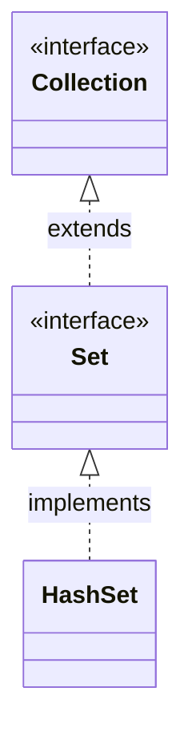

# HashSet集合

## Java集合概述

Java 集合类存放于 **java.util** 包中，是一个用来存放对象的容器。

1. 集合只能存放对象（当我们向集合中存入 **int 1** 时，实际上是自动转换成 **Integer** 类后存入的）。

2. 在 **jvm** 中，集合存放的是多个对象的引入，对象本身存在于堆内存中。

3. 集合可以存放不同类型，不限数量的数据类型。

Java 集合可分为 **Set **、**List** 、**Map** 三种

* Set：无序、不可重复的集合

* List：有序、可重复的集合

* Map：具有映射关系的集合

在 JDK5 之后，增加了 **泛型** ，Java集合可以记住容器中对象的数据类型。

## HashSet

HashSet 是 **Set** 接口的典型实现，大多数时候使用 **Set** 集合时都使用这个实现类。

我们大多数时候说的set集合指的都是 **HashSet** 。HashSet 是按照 **Hash 算法** 来存储集合中的元素，因此具有很好的存取和查找性能。

### HashSet 的特点

* 不能保证元素的排列顺序

* 不可重复

* **不是** 线程安全的

* 集合元素可以使用 **null**

当向 **HashSet** 集合中存入一个元素时，HashSet 会调用对象的 **hashCode()** 方法来得到该对象的 **hashCode** 值，然后根据 **hashCode** 值来决定该对象在 **hashSet** 中的存储位置。

如果两个元素的 **equals**() 方法返回true，但它们的 **hashCode** 返回值不相等，hashSet 将会把它们存储在不同的位置，但依然可以添加成功。

### HashSet 的继承关系

### 使用 HashSet

