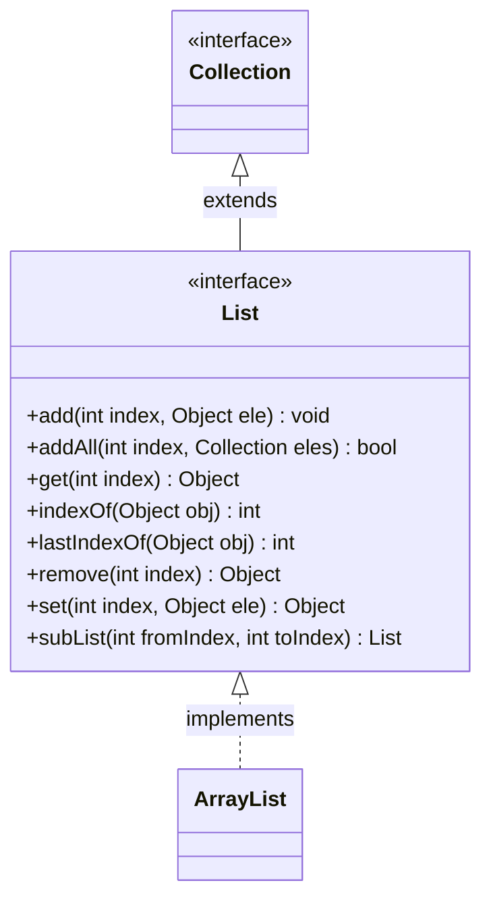

# List集合

**List集合** 用于内的元素是有序、可重复的。集合中的每个元素都有其对应的 **顺序索引** 。

List 允许使用重复元素，可以通过索引来访问指定位置的集合元素。

List 默认按照元素的添加顺序设置元素的索引。 

**List接口** 里添加了一些根据索引来操作集合元素的方法。 

## ArrayList

**ArrayList 类** 实现了 **List 接口** 。



```java
public class TestList {
	public static void main(String[] args) {
		List<String> list = new ArrayList<String>();
		
		//向 list 中添加元素
		list.add("ele1"); //索引下标0
		list.add("ele2"); //索引下标1
		
		//指定索引位置添加元素
		list.add(1,"ele3");

		//向某个位置插入另一list
		list.addAll(1,list);
		
		//通过索引获取元素
		list.get(1);
		
		//获取 List 长度
		list.size();
		
		//查找元素第一次出现的索引
		list.indexOf("ele1");
		
		//查找元素最后一次出现的索引
		list.lastIndexOf("ele1");
		
		//根据索引移除指定元素
		list.remove(1);
		
		//也可以根据元素内容移除指定元素(只移除一次)
		list.remove("ele1");
		
		//根据指定的索引修改元素
		list.set(4, "ele4");
	}
}
```

## Vector

**Vector** 是 **List接口** 的另一个经典实现

Vector 和 List 的比较：

* **Vector** 是一个很老的实现类，**ArrayList** 是后来写的。
* **Vector** 是线程安全的，而 **ArrayList** 是 **线程不安全** 的。
* 但是 **没必要** 为了线程安全而选用 **Vector** 。