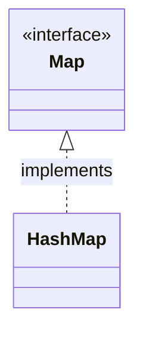

# Map集合

Map 用于保存具有映射关系的数据，因此 **Map 集合** 中保存两组值：

* 一组用于保存 map 中的 **Key**
* 一组用于保存 map 中的 **Value**

Map中的  **Key** 和 **value** 都可以是任何引用类型的数据

**Map中的 key 值不允许重复**，即同一个 **Map 对象** 的任何两个 Key 通过 **equals(Object key)** 方法进行比较时都会返回 **false** 。

Key 和 Value 之间存在 **单向一对一** 关系，即通过指定的 Key 总能找到 **唯一确定的** Value 。

Map 的经典实现有 **HashMap** 、**Hashtable** 、**TreeMap**

## 遍历 Map集合

### 通过 key 或 value 实现遍历

1. 方法 **Set<k> keySet()** : 获取 **map** 的 **key** 集合。
2. 方法 **Collection<V> values()** : 获取 **map** 的 **Value** 集合。

然后就可以遍历 Set 或者 Collection 来实现对 map 的遍历了。

```java
import java.util.HashMap;
import java.util.Map;
import java.util.Set;

public class TesttTaverMap {
	public static void main(String[] args) {
		
		Map<Integer,String> map = new HashMap<Integer,String>();
		
		map.put(1, "元素1");
		map.put(2, "元素2");
		
		Set mapKeySet = map.keySet();
		
		for (Object obj : mapKeySet) {
			System.out.println(obj + "==>" + map.get(obj));
		}
	}
}
```

### 使用 entrySet() 方法遍历

> ### entrySet
>
> public [Set](https://docs.oracle.com/en/java/javase/15/docs/api/java.base/java/util/Set.html)<Map.Entr<K,V>> entrySet()
>
> Returns a [`Set`](https://docs.oracle.com/en/java/javase/15/docs/api/java.base/java/util/Set.html) view of the mappings contained in this map. The set is backed by the map, so changes to the map are reflected in the set, and vice-versa. If the map is modified while an iteration over the set is in progress (except through the iterator's own `remove` operation, or through the `setValue` operation on a map entry returned by the iterator) the results of the iteration are undefined. The set supports element removal, which removes the corresponding mapping from the map, via the `Iterator.remove`, `Set.remove`, `removeAll`, `retainAll` and `clear` operations. It does not support the `add` or `addAll` operations.
>
> - Specified by:
>
>   `entrySet` in interface `Map<K,V>`
>
> - Returns:
>
>   a set view of the mappings contained in this map

```java
import java.util.Map;
import java.util.HashMap;
import java.util.Map.Entry;
import java.util.Set;

public class TesttTaverMap {
	public static void main(String[] args) {
		
		Map<Integer,String> map = new HashMap<Integer,String>();
		
		map.put(1, "元素1");
		map.put(2, "元素2");
		
		//使用 entrySet 获取 entry 集合
		Set<Entry<Integer, String>> mapEntrySet = map.entrySet();
		
		for (Entry<Integer,String> entry : mapEntrySet) {
			System.out.println("key:" + entry.getKey() + ",value:" + entry.getValue());
		}
	}
}
```

## HashMap 类

**HashMap 类** 是 **Map 接口** 的经典实现



```java
import java.util.Map;
import java.util.HashMap;

public class TestHashMap {
	public static void main(String[] args) {
		
		// 实例化一个 HashMap 类
		Map<Integer,String> map = new HashMap<Integer,String>(); 
		
		// 添加一组 k=>v
		map.put(1, "a");
		map.put(2, "b");
		
		// 获取 map 的 长度
		map.size();
		
		// 根据 key 取 value
		map.get(1);
		
		// 根据 key 移除 k=>v
		map.remove(2);
		
		// 检查 map 是否存在某个 key
		map.containsKey(1);
		
		// 检查 map 是否存在某个 value
		map.containsValue("a");
		
		// 清空 map
		map.clear();
	}
}
```
HashMap 判断两个 Key相等的标准是：

1. 两个 Key 通过 **equals(Object obj)** 函数返回 true
2. 两个 Key 的 hashCode 相等

判断两个 Value 相等的标准是：

通过 equalHashMap 判断两个 Values ，返回 true

## Hashtable 类

Hashtable 也是 Map 接口的一个经典实现，方法与 HashMap 一致。

与 HashSet 一样，Hashtable 、HashMap 也无法保证内部元素的顺序。

Hashtable 判断 Key 值相等、判断 Value 值相等的标准和 HashMap 一致。

### Hashtable 与 HashMap

* Hashtable 是一个早期的 Map 实现类

* Hashtable 是 **线程安全** 的，HashMap 不是。

* Hashtable **不允许** 使用 null 作为 key 或 value，而 HashMap 可以。

## TreeMap 类

TreeMap 存储 Key-Value 对时，需要根据 **Key** 对 Key-Value 进行排序。TreeMap 可以保证内部的所有元素处于 **有序状态** 。

和 **TreeSet** 一样，TreeMap 提供 **自然排序** 和 **定制排序** 。

### TreeMap 自然排序

TreeMap 的所有 Key 必须实现 **Comparable** 接口 ，而且所有的 **Key** 应该是 **同一个类** 的对象，否侧会抛出 **ClassCastException** 。

```java
public class TestTreeMap {
	public static void main(String[] args) {
		
		/*
		 使用 Key 元素实现的 compareTo 方法
		 (Integer、String 内置有 compareTo 方法
		*/
		Map<MyKey,String> testor = new TreeMap<MyKey,String>();
		testor.put(new MyKey("张"),"我姓张");
		testor.put(new MyKey("李"),"我姓李");
		testor.put(new MyKey("孙"),"我姓孙");
		System.out.println(testor);
	}
}

// Key 元素必须 实现 Comparable
class MyKey implements Comparable {
	String name;
	MyKey(String name){
		this.name = name;
	}
	//提供用于排序的方法 compareTo
	@Override
	public int compareTo(Object o) {
		//规则：张排最前面，其他无所谓
		if (this.name == "张") {
			return -1;
		}
		else {
			return 1;
		}
	}
}
```

### TreeMap 定制排序

创建 TreeMap 时，传入一个 **Comparator** 对象，该对象负责对 TreeMap 中所有的 Key 进行排序。这种情况下不需要 **Key** 实现 Comparable 接口。