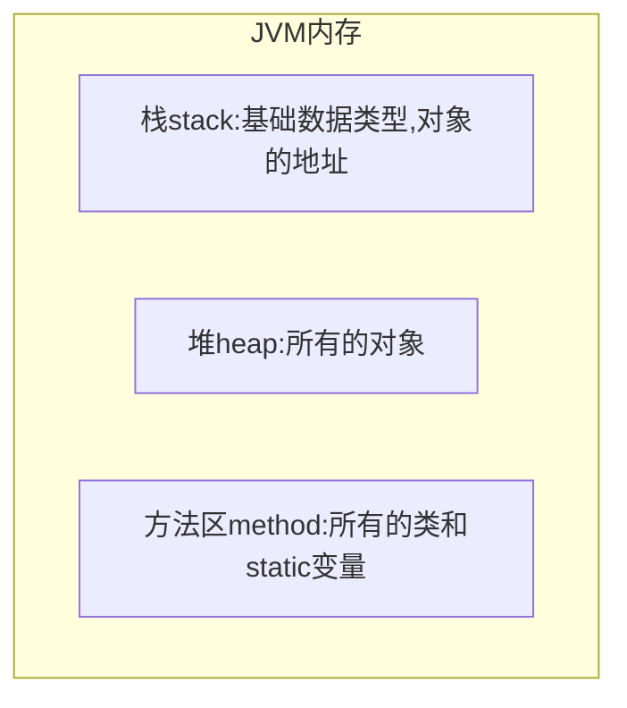

# 方法的参数传递

方法：必须由其所在类或对象调用才有意义，含有参数：

* 形参：方法声明时的参数
* 实参：方法被调用时传递给形参的参数值

**在Java中，方法的参数传递方式只有一种：值传递。**即将实际参数值的副本传入方法内，而参数本身不受影响。



```java
public class TestTransfer {
    public static void swap(int i) {
        i = 6;
        System.out.println("swap 方法中 i的值是："+i);
    }
    public static void main(String[] args) {
        int a = 0;
        swap(a);
        System.out.println("main 方法里，变量a的值是"+a);
    }
}
```

**实参**和**形参**都在**栈内存**中，都保存了**对象**实际在**堆内存中的地址**，对应地址的**对象**属于**引用对象**。将**对象**作为参数传递给函数时，是将**栈内存**中的**实参**的值（*里面记录了对象的地址*）传递给了**栈内存**中的**形参**。这样，**实参**和**形参**指向了**堆内存**中的同一个**引用对象**。

所以，针对**引用对象**传参动作，传递的也是值，但传递的是**引用对象**的值，而这个**值**记录了堆内存中一个**对象**的地址。

### 总结：方法的参数传递

1. 如果方法的形参是基本数据类型，那么实参（实际的数据）向形参传递参数时，就是直接把实参的值（保存在栈内存中）传递，把实参的值进行拷贝，传递给形参。

2. 如果方法的形参是对象，那么实参（实参的类型必须和形参一致）向形参传递参数时，也是把值（保存在栈内存中）进行拷贝传递给形参，但这个值是引用对象在堆内存中的地址。

3. 基本数据类型都是保存在栈内存中，引用对象的地址保存在栈内存中，引用对象的实体保存在堆内存中。

   综上：方法的参数传递，本质上就是**变量**在**栈内存**中的值的传递。