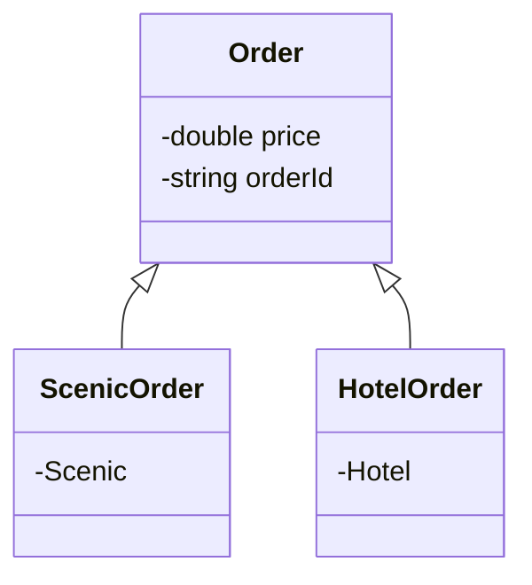

# 继承



使用 extends 声明继承关系：

```java
class Order {
	 String orderId;	//订单编号
	 double orderPrice; //订单总价	
}

/* ScenicOrder（景点订单） 通过关键字 extends 继承了 Order（订单） */
class ScenicOrder extends Order{
	 String scenicName; //景点名称
     /* 
     	此时，ScenicOrder 类具有三个属性：
     	this.orderId (来自父类 Order)
     	this.orderPrice (来自父类 Order)
     	this.scenicName (自有属性)
     */
}
```

#### 继承的定义：

 * 被继承的类被称为：父类 / 基类 / 超类 / Superclass

 * 执行继承的类被成为：子类 / Subclass

 * 对业务进行了进一层的抽象：

       * Subclass is a Superclass；
       * 实现了代码的复用，共有的 **属性** 和 **方法** 定义在 **父类** 中。
       * **子类** 基于共有的 **父类** 提供的 **属性** 和 **方法** 以外，实现了自己特有的 **属性** 和 **方法** 。
    
 * 继承表征了 **Subclass** 和 **Superclass** 之间的**关系**，不应该仅为了复用某一个功能而使用继承。

 *  在Java中，**继承** 的关键字是 “ **extends** ”，即 **子类** 不是 **父类** 的 子集，而是父类的 “ **扩展** ”；

 * 继承的语法：

      ```java
      class Subclass extends Superclass { }
      ```

#### 继承的使用：

* 当 Subclass 继承 Superclass 后，子类默认拥有了父类的属性和方法，可以直接使用 this关键字调用父类定义的属性和方法。
* 子类不能直接访问父类中私有的( private )的属性和方法(参考6.5四种访问修饰符)。
  ```java
  class SuperClass {
  	private int foo;
  	public int bar;
  	
  	public int getFoo() {
  		return this.foo;
  	}
  	
  	// 父类自己的方法内部可以直接访问 私有的 foo
  	public void info() {
  		System.out.println(this.foo);
  	}
  }
  
  class SubClass extends SuperClass{
  	
  	// 子类不能直接访问 继承而来的 私有的 foo
  	public int subGetFoo() {
  		return this.foo;
  	}
  	
  	/* 
  		子类可以通过 继承而来的 public getFoo 来访问 foo
  	 	说明 foo 被继承了，只是无法直接访问
  	*/
  	public void checkFoo() {
  		System.out.println(this.getFoo());
  	}
  }
  ```

## 单继承的特性：

Java 只支持单继承，不允许多重继承：一个子类只能有一个父类

* 多重继承：多个父类 （ **不支持** ）。
* 多层继承：多层级的 **单继承** （ 支持 ）。

