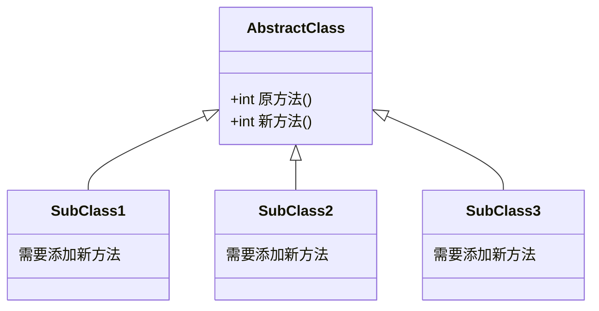
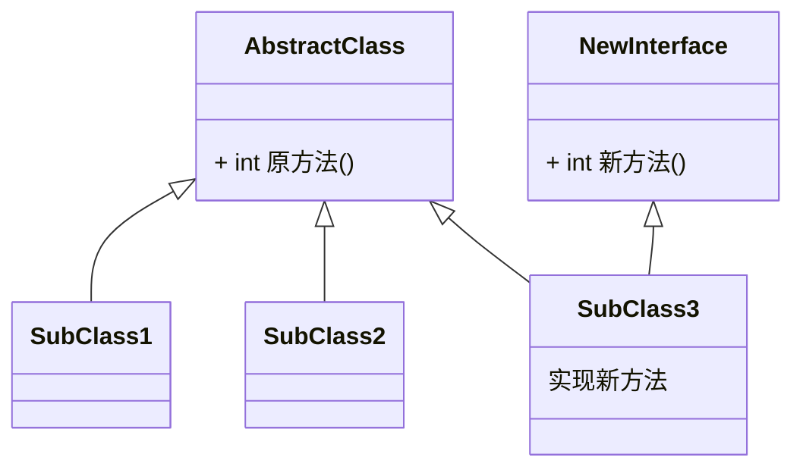
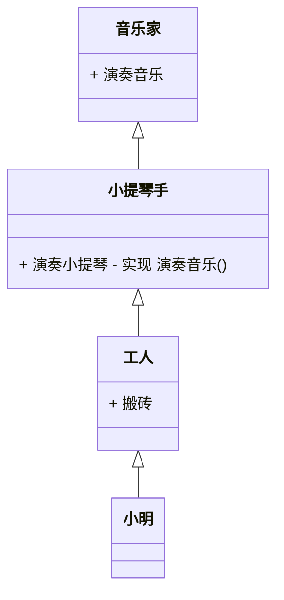
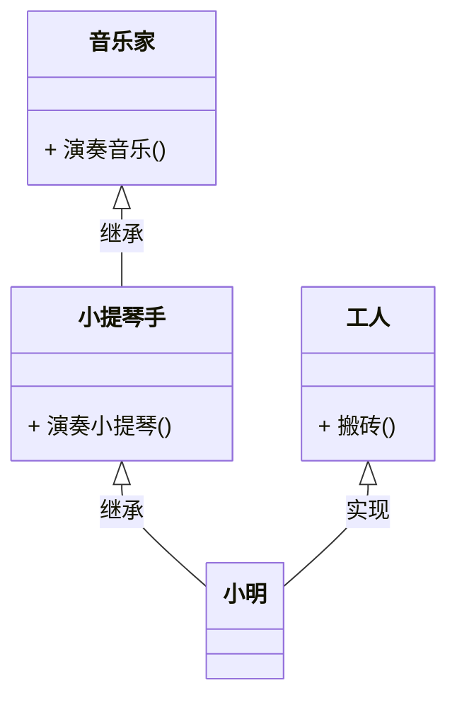

# 接口 interface

java不支持 **多重继承** ，但有时必须从几个类中派生出一个子类，继承它们的所有属性和方法。这时使用 **接口 ( interface )** 就可以实现多重继承的效果。

* **接口 (interface)** 是抽象方法和常量值的定义集合。
* 从本质上讲，接口是一种特殊的抽象类，这种抽象类中只包含常量和方法的 **定义** ，而没有常量和方法的 **实现** 。
* 一个类可以实现多个接口，接口也可以继承其他接口。

#### 接口的特点：

* 用 interface 来定义

* 接口中的所有成员变量默认都是 **public** **static** **final** 修饰的 ( 全局常量 )

* 接口中所有方法默认都是 **public** **abstract** 修饰的

* 接口没有构造器

* 接口采用多重继承机制

* 接口之间可以互相继承，使用 **extends** 关键字

  ```java
  public interface Runner {
      // 定义的常量默认加了 public static final
      int ID = 1;
      // 定义的方法默认加了 public abstract
      void start();
      public void run();
      void stop();
}
  ```

#### 实现接口：implements

* 实现接口的类中如果存在未实现的接口方法，则为抽象类
* 接口的主要用途就是被实现类实现 ( 面向接口编程 )
* 与继承关系类似，接口与实现类之间存在 **多态性** 。

* 实现接口的语法格式： 先写 **extends** 后写 **implements** 。

```java
class SubClass extends AbstractClassA Implements InterfaceA,InterfaceB {
  
}
interface InterfaceA {}
interface InterfaceB {}
abstract class AbstractClassA{}
```

#### 接口的应用（一）

如果使用抽象类增加新功能，当抽象类改动时，继承此抽象类的子类都必须改动：


所以对于新增的功能(逻辑上并不是抽象类所定义)，使用接口实现：


#### 接口的应用（二）

在以上案例中，其内核逻辑并不在于开发难度的考量，而在于业务继承逻辑的合理性：



在上面的案例中，为了实现 **小明身兼数职** 这一场景而不得不使用多重继承，导致*[工人]* 类被 **污染** 了：工人类被塞入了 **没有关联** 的方法。

所以，使用接口实际上是为了实现 **SuperClass** 更真实准确的抽象，以避免 **多层继承** 对 **SuperClass** 的污染 :



#### 接口的应用（三）

求知讲堂对接口的讲解：

抽象类是对一类事物的高度抽象，其中既有 **属性** 也有 **方法** 。而 **接口** 是对 **方法** 的抽象，定义了一系列 **行为** 。

当需要对一类 事物 抽象的时候，应该是使用 **抽象类** ，形成一个 **父类** 。当需要对一系列 **行为** 进行抽象，就使用 **接口** ，需要这些动作的时候去 **实现** 接口即可。